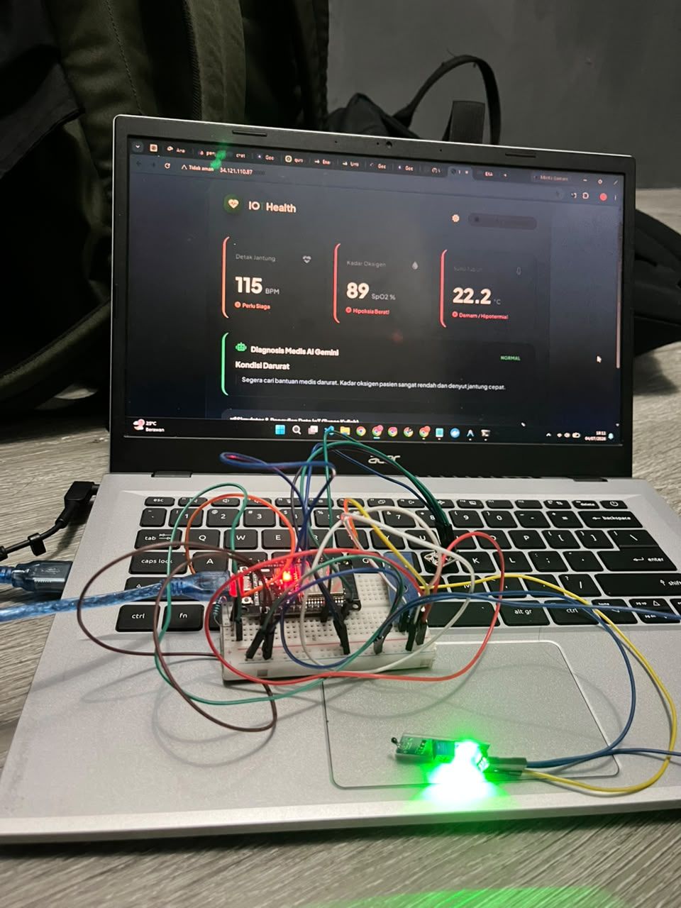
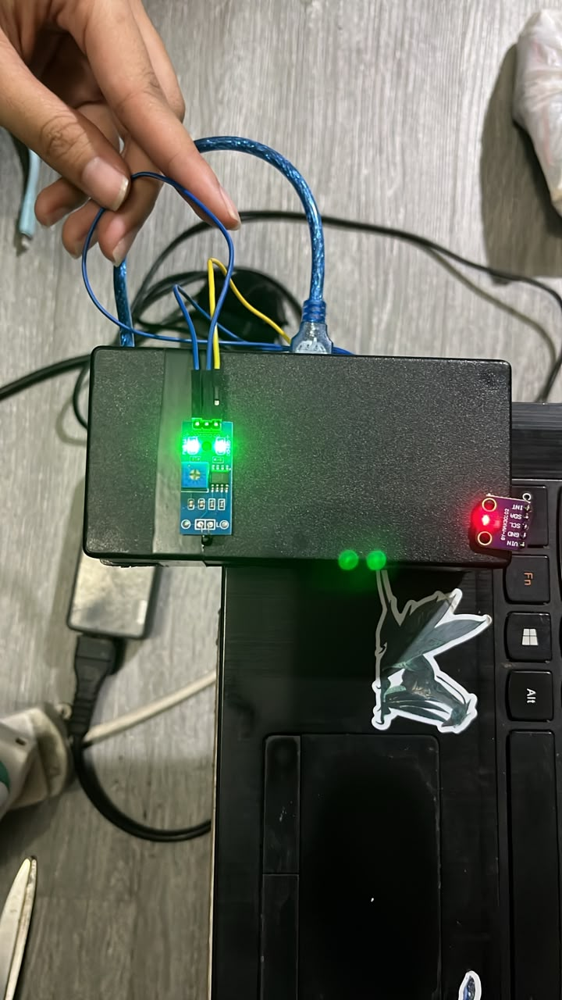
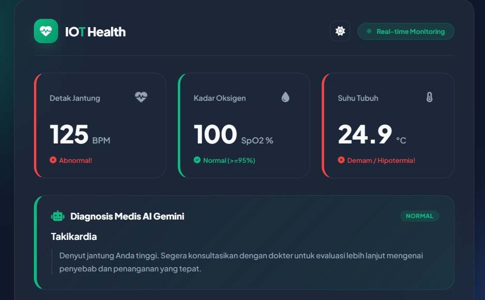

# LAPORAN TUGAS BESAR MATA KULIAH INTERNET OF THINGS (IoT)
## Proyek: IoT Health Dashboard Terintegrasi AI Gemini

**Disusun Oleh: Kelompok 7**
* **Mata Kuliah**: Internet of Things (IoT)
* **Program Studi**: Teknik / Ilmu Komputer

---

## 1. Latar Belakang & Deskripsi Proyek
Dalam proyek tugas besar ini, kelompok kami merancang dan membangun sebuah sistem **Smart Health Monitoring** berbasis IoT. Alat ini dirancang untuk mendeteksi parameter kesehatan vital manusia secara real-time—yaitu detak jantung (BPM) dan saturasi oksigen (SpO2)—serta suhu tubuh. 

Untuk memberikan nilai tambah dan memenuhi kriteria teknik modern, data sensor yang dikirimkan oleh mikrokontroler tidak hanya ditampilkan berupa angka mentah, melainkan dikirimkan ke **LLM Gemini 2.5 Flash** (melalui **Armada AI Gateway**) untuk dianalisis kesehatannya secara cerdas, kemudian ditampilkan pada halaman website dashboard yang interaktif dan premium.

---

## 2. Komponen Perangkat Keras yang Kami Gunakan
Dalam merakit alat ini, kami menggunakan beberapa komponen utama berikut:
1. **ESP32 Development Board**: Sebagai otak utama sistem yang bertugas membaca sensor, memproses data analog/digital, terhubung ke Wi-Fi, dan melakukan komunikasi data HTTP REST API ke server cloud.
2. **Sensor Heart Rate & SpO2 MAX30102**: Sensor optik yang kami gunakan untuk mengukur detak jantung (BPM) dan kadar oksigen di dalam darah (SpO2) melalui ujung jari.
3. **Modul Sensor Suhu NTC Thermistor**: Sensor suhu analog untuk memantau suhu tubuh pengguna.
4. **Lampu LED Indikator**: Dihubungkan ke **Pin GPIO 25** sebagai penanda visual detak jantung (berkedip mengikuti denyut nadi asli).
5. **Passive Buzzer**: Dihubungkan ke **Pin GPIO 13** sebagai output audio untuk alarm otomatis jika AI mendeteksi parameter tubuh yang berbahaya.
6. **Resistor**: Digunakan untuk membuat rangkaian pembagi tegangan (voltage divider) pada sensor suhu NTC.

### Dokumentasi Perangkat Keras (Hardware)
Berikut adalah foto dari rangkaian komponen perangkat keras yang kami gunakan:

Dan di bawah ini adalah alat yang sudah selesai kami rakit dan dikemas di dalam kotak (*casing*):

---

## 3. Cara Kami Memenuhi Kriteria Tugas Mikrokontroler
Untuk memenuhi semua persyaratan wajib dari dosen, berikut adalah cara kelompok kami menerapkannya:

* **Komunikasi Data**: Kami memilih menggunakan protokol **HTTP REST API** karena sangat handal untuk integrasi ke web. ESP32 mengirim data menggunakan metode `POST` dengan payload JSON, dan web dashboard mengambil data terbaru menggunakan metode `GET` (polling setiap 1.5 detik).
* **Penerapan ADC (Analog to Digital Converter)**: Kami menerapkan ADC untuk membaca tegangan analog dari sensor suhu NTC menggunakan fungsi bawaan `analogRead(GPIO 34)`.
* **Penerapan PWM (Pulse Width Modulation)**: Kami mengimplementasikan PWM untuk membunyikan *Passive Buzzer* menggunakan fungsi `tone()`. Fungsi ini secara otomatis memodulasi sinyal PWM pada timer hardware ESP32 untuk menghasilkan frekuensi nada suara yang dinamis.
* **Penerapan DAC (Digital to Analog Converter)**: 
  * **Secara Sistem (Internal Sensor)**: Sensor MAX30102 yang kami pasang menggunakan sistem **DAC internal** di dalam chip-nya untuk menyalurkan arus analog presisi ke LED sensor.
  * **Secara Teori (Audio Output)**: Kami memanfaatkan modulasi pulsa cepat (*PWM-based DAC*) pada buzzer untuk menghasilkan gelombang suara audio analog murni dari nilai digital.

---

## 4. Penjelasan Kode Firmware ESP32 (`kode-ionya.ino`)
Firmware ditulis menggunakan Arduino IDE. Logika utama yang kami buat adalah sebagai berikut:

* **Inisialisasi (`setup()`)**: ESP32 menyalakan Serial monitor (baudrate 115200), tersambung ke Wi-Fi kosan/rumah ("BIG FAMILY"), dan mencari sensor MAX30102 via jalur **I2C (SDA Pin 21, SCL Pin 22)**.
* **Pembacaan Data (`loop()`)**:
  * Kami membuat buffer memori berukuran 50 sampel untuk menampung data mentah sensor MAX30102.
  * Terdapat fungsi `checkForBeat()` untuk mendeteksi detak jantung secara instan. Jika terdeteksi detak, program akan menyalakan LED dan membunyikan buzzer sejenak (40ms).
  * Data buffer diproses dengan algoritma `maxim_heart_rate_and_oxygen_saturation` untuk mendapatkan hasil BPM dan SpO2 yang valid.
  * Nilai analog dari NTC diubah menjadi satuan suhu Celsius menggunakan rumus matematika pembagian tegangan.
* **Pengiriman Data**: Setiap 5 detik sekali, jika jari terdeteksi, data dikirim ke server backend (`http://34.121.110.87:8000/api/kirim-data`). Jika respon server mendeteksi kondisi tidak sehat, buzzer akan berbunyi panjang sebagai alarm peringatan.

---

## 5. Penjelasan Backend FastAPI (`main.py`)
Untuk bagian server backend, kami membangunnya menggunakan Python dengan framework FastAPI:

* **Endpoint `/api/kirim-data`**: Menerima data sensor dari ESP32, lalu memanggil fungsi AI Gemini. Respons AI yang berupa diagnosis status dan saran medis disimpan di memori server dan dikirimkan kembali ke ESP32.
* **Endpoint `/api/data`**: Menyediakan data kesehatan terbaru dalam format JSON agar bisa diambil oleh website secara real-time.
* **Integrasi AI Gemini (Armada Gateway)**: Kami menggunakan SDK OpenAI untuk terhubung ke gerbang AI Armada (`https://35.212.149.5/v1`) dengan model `gemini-2.5-flash`.
* **Klasifikasi Kesehatan**: Kami menerapkan fitur **JSON Schema** agar Gemini mengembalikan diagnosis medis secara terstruktur. AI kami paksa mengklasifikasikan status ke salah satu kategori tegas berikut: *Sehat, Stres / Kelelahan, Gangguan Pernapasan, Takikardia, Bradikardia,* atau *Kondisi Darurat*.
* **Mode Fallback Lokal**: Kami juga menambahkan fungsi simulasi lokal berbasis logika aturan (*rule-based*) agar website kami tetap bisa menampilkan diagnosis jika API Key belum dipasang atau server AI sedang offline.

---

## 6. Penjelasan Halaman Website (`index.html`)
Halaman website kami buat menggunakan HTML, CSS, dan Javascript tanpa framework rumit agar performanya ringan:

* **Desain Visual**: Kami membuat tampilan bertema medis modern dengan efek *glassmorphism*, bayangan halus, dan skema warna gradien dinamis.
* **Fitur Dark Mode**: Kami menambahkan tombol sakelar tema gelap/terang di bagian atas agar dasbor terlihat lebih premium dan interaktif.
* **Kartu Sensor Dinamis**: Warna batas kartu detak jantung, oksigen, dan suhu akan otomatis berubah warna (Hijau = Sehat, Jingga = Siaga, Merah = Bahaya) tergantung nilai sensor yang masuk. Ikon jantung juga berdenyut lebih cepat/lambat sesuai BPM asli.
* **Panel Simulator**: Kami menambahkan panel khusus di bagian bawah halaman web. Ini sangat membantu kelompok kami saat melakukan demonstrasi di hadapan dosen tanpa harus selalu menyalakan alat ESP32 (cukup klik tombol preset atau input nilai manual untuk melihat perubahan dasbor secara instan).

### Dokumentasi Antarmuka (UI) Website Dashboard
Berikut adalah tangkapan layar (screenshot) dari dasbor monitoring kesehatan yang kami bangun:

---

## 7. Tantangan Pengerjaan yang Kami Hadapi
Selama mengerjakan proyek ini, kelompok kami menghadapi beberapa tantangan teknis:
1. **Kalibrasi Sensor NTC**: Karakteristik resistor suhu analog NTC cukup sensitif dengan suhu udara ruangan. Kami harus menyesuaikan rumus pembagian tegangan agar suhunya akurat saat disentuh kulit.
2. **Optimasi Analisis AI**: Awalnya pembacaan suhu tubuh yang rendah (karena sensor belum ditempel erat/membaca suhu ruangan) membuat Gemini mendiagnosis kondisi bahaya "Hipotermia". Akhirnya, kami memutuskan untuk **mengabaikan parameter suhu** dalam prompt Gemini AI (Gemini hanya menganalisis BPM & SpO2 untuk diagnosis), namun data suhunya tetap kami tampilkan di dashboard.
3. **Akses Jaringan Server**: Karena server kami jalankan pada VPS cloud, kami sempat kesulitan mengakses halaman web dari luar. Kami berhasil menyelesaikannya dengan mengubah *host binding* uvicorn FastAPI ke IP `0.0.0.0` agar bisa diakses menggunakan IP publik server.

---

##8. Anggota Kelompok
1. Muhammad Hendriansyah - 23552011351
2. Ferdinand sulaiman - 23552011197
3. Febrina Melati - 23552011010

---

##Lampiran Video dan Postingan Linked In
1. Link Youtube (Video Demo): https://youtube.com/shorts/pNXeMS6i-fE?feature=shared
2. Link LinkedIm: https://www.linkedin.com/posts/febrinamelati_iot-esp32-embeddedsystems-ugcPost-7479150579601133568-ESk7/?utm_source=share&utm_medium=member_desktop&rcm=ACoAADbn06YB_k1nvLOqazI2D2g09YyWRFoUFZI
